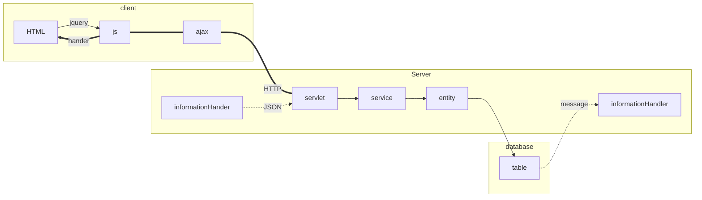

```mermaid
graph LR
    subgraph client
    HTML--jquery-->js
    js===ajax
    js==hander==>HTML
  end
  subgraph database
    table
  end
  subgraph Server
    ajax==HTTP===servlet
    servlet-->service
    service-->entity
    entity-->table
    table-.message.->informationHandler
    informationHander-.JSON.->servlet
  end
  
  
    
    

```
# main
> main
```java
public class 
```